<h1 align="center">Hi! I'm Yevhen</h1>
<h3 align="center">
A top-tier web developer with AI expertise and bleeding-edge tech.
</h3>
<h4 align="center">Navigating the realms of AI, Full Stack frameworks and architecting Cloud solutions - I've been a deep explorer in these captivating tech terrains!</h4>

  

</a>
</a>

<h3 align="center">Let's Get Connected:</h3>

 &nbsp;&nbsp;&nbsp;
&nbsp;&nbsp;&nbsp;&nbsp;

  

